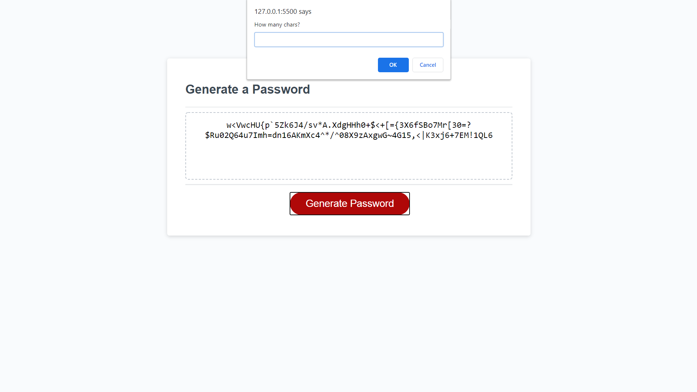

# passwordGenerator

# The Assignment
The task for this homework assignment was to create a password generator. This application needs to generate a password for the user made up of randomly selected and arranged characters that follows certain parameters chosen by the user. These parameters include total number of characters (between 8 & 128), and the user's choice of between 1 and 4 of the following character types: lowercase letters, uppercase letter, numbers, or special characters.

# Issues
* My first issue was figuring out how to set up for-loops that picked random characters from my arrays I created for each character type and added them to the password. Ryan helped me get the ball rolling here in our tutoring session.
* The next big hurdle was getting the application to add only a few of each character type selected instead of the total password length for each character type. For example, if the user chose to have a 10 character password, I needed to make sure that there were 10 characters ~in total~, not 10 of each character type they chose to include. This was remedied by creating variables for the amount of character types the user chose as well as for the amount of characters for each type, and plugging them into an appropriate equation that recognized what the total length of the password was supposed to be.
* Then, I ran into issues when the total character length of the  password was a number not divisible by the amount of character types the user chose (e.g.: 10 characters total, 3 character types chosen). The application was adding an even amount of each character type, even if that added up to too many characters for the length the user specified (in the aforementioned example, it would give you a 12 character password at this point). I fixed this by using the "slice( )" function.
* Lastly, I just needed to get the characters within the password to shuffle up. This was a quick fix with a little Googling!

# Looking Forward

If I were to expand on this project, I'd like to allow the user to input certain combinations of numbers they'd like to avoid (such as the digits of their birthday or address). I also think it would be cool if there were a button that let you save your generated password to your Google account or a password manager like LastPass.

<!-- Screenshot of working application -->

# Installation

Simply follow this link and view the webpage.

https://dorrianweber.github.io/passwordGenerator/

# Usage

Clicking the "Generate Password" button initiates a series of prompts.

* First, decide what the length of the password will be. If you enter a non-number, a number less than 8, or a number greater than 128, you will be reprompted to enter a number within that range.
* Next, you will be prompted to decide whether or not you want to include characters of the 4 different types. If you don't confirm any of these, you will be reprompted to select at least one type.
* After responding to all prompts, your password will be displayed in the text box in the center of the screen.

# Credits

I was helped in this assignment by three talented developers & patient teachers:
* My TA Ryan Skog (in our tutoring session on 1/11/21)
* My friend Nick Badal, Mobile Engineering Manager at Flickr
* My friend Sam Fields, Software Engineer at VSP Vision Care

Additionally, I utilized the knowledge of Sayantan Maiti from this article (https://www.geeksforgeeks.org/how-to-remove-a-character-from-string-in-javascript/) and Joel Mellon from this thread (https://stackoverflow.com/questions/3943772/how-do-i-shuffle-the-characters-in-a-string-in-javascript).